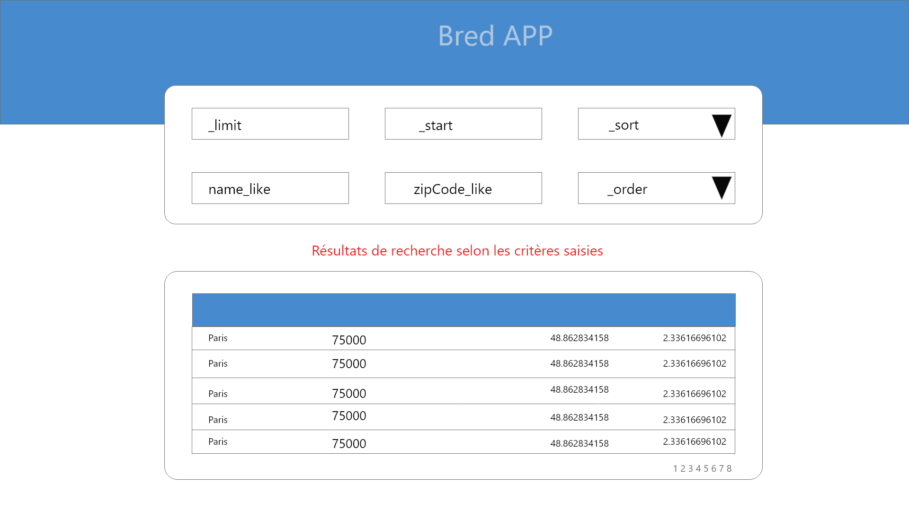
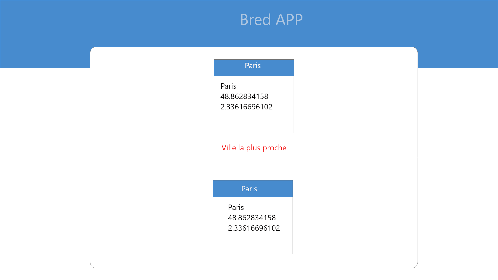

# But de l'exercice

Le but de l'exercice est d'implémenter une application angular conforme aux maquettes proposées

L' application web contient 2 écrans :
* Un écran qui permet la recherche de villes
* Un écran qui affiche pour une ville donnée la ville la plus proche

L'api de recherche est décrite dans le fichier openapi.yml

La stack technique doit restée celle proposée (angular) mais lse choix de frameworks autour, notament les composants graphiques et autres sont libres.

L'application doit être compatible avec au moins un des trois navigateurs les plus utilisés

# Ecrans

## Recherche de villes

### Formulaire pour définir les critères de recherches

Une formulaire avec 6 critères de recherche :
* _limit : taille du résultat 10 par défaut
* _start : index du premier résultat 0 par defaut
* _sort : La propriété sur laquelle on effectue le tri (zipCode ou name)
* _order : ASC ou DESC asc par defaut
* name_like : pattern pour la recherche d'une ville par nom
* zipCode_like : pattern pour la recherche d'une ville par zipCode

### Tableau de résultats des villes

Un tableau de résultats affichant la liste des villes respectant les critères de recherche.
Les colonnes du tableau sont les suivantes :
* Name
* ZipCode
* Coordinates :
  * x
  * y

## La ville la plus proche

Au click sur une ligne du tableau, afficher un nouvel écran décrivant pour la ville qui a été sélectionné la ville la plus proche.

A noter que l'api renverra toujours la même ville quelque soit la ville sélectionnée.

# Comment débuter
* La commande `npm run start-mock-server` permet de lancer le serveur de mock ( un descriptif de l'api est disponible dans le openapi.yml)
* La commande `npm start` permet de lancer l'application angular 
